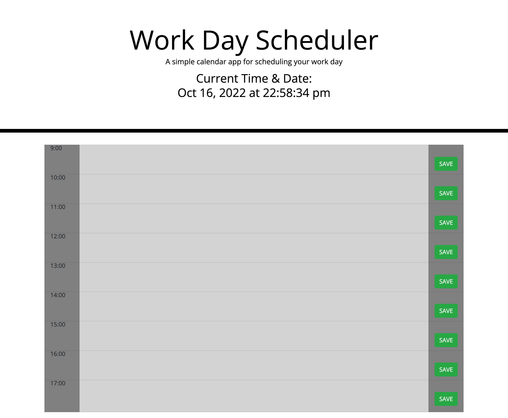

# Work Day Scheduler Starter Code

# Made with HTML, CSS, BootStrap, JQuery and JavaScript

# Creating a Work Day scheduler that showcases a normal workday 9am - 5pm.

# User can input notes in each time block

# Learned how to write the basics of JavaScript, Learned how to use the Jquery & BootStrap API

# 

# Ryan Dong

# Ryandong7@gmail.com

# Project Link: https://arspeke8.github.io/Challenge-3-password-generator/
